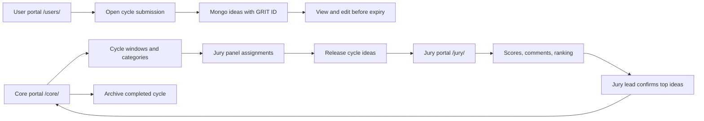

# GRIT

GRIT is a Flask and MongoDB/SQLite competition app for **Grassroot Innovation In Technology**. It provides:

- A public idea submission portal with search, Employee ID plus passcode edit unlock, HTML/plain-text preview, image attachments, cycle-aware closure, category limits, and pagination.
- A core committee portal for cycle windows, categories, jury panels, portal users, release/close controls, dashboards, and archive views.
- A jury portal for category-scoped review, 1-10 scoring, comments, like/neutral/dislike signals, average-score ranking, lead comments, refreshable score review, and gated top-idea confirmation.
- OpenAPI definitions at `/api/openapi.json` and Swagger UI at `/api/docs`.

## Runtime

Target Python version: **Python 3.11.1**.

```powershell
py -3.11 -m venv .venv
.\.venv\Scripts\Activate.ps1
python -m pip install -r requirements.txt
Copy-Item .env.example .env
```

Set `MONGO_URI`, `MONGO_DB_NAME`, `SECRET_KEY`, and the bootstrap core account values in `.env`.

For the company demo, persistence is currently local SQLite. Control the backend in `config.ini`:

```ini
[database]
sqlite = yes
sqlite_path = data/grit.sqlite3
```

- `sqlite = yes` runs the full platform on `data/grit.sqlite3`; data survives app restarts.
- `sqlite = no` switches the same code path back to MongoDB.
- MongoDB code is retained in `app/db.py`; SQLite is an adapter used for the approval/demo phase.

One-command local start:

```powershell
python start_grit.py
```

`start_grit.py` prepares MongoDB collections/indexes, refreshes the sample dataset, and starts the Flask app on `http://127.0.0.1:5000`.
When `config.ini` has `sqlite = yes`, the same command prepares and uses SQLite instead of MongoDB.

Manual equivalent:

```powershell
python mongo_setup.py
python seed_sample_data.py
python run.py
```

Open the app after startup:

| Portal | URL |
| --- | --- |
| Entrant/user portal | `http://127.0.0.1:5000/users/` |
| Core committee portal | `http://127.0.0.1:5000/core/` |
| Core final winners | `http://127.0.0.1:5000/core/final-winners` |
| Jury portal | `http://127.0.0.1:5000/jury/` |

The protected core and jury URLs require portal login at `http://127.0.0.1:5000/auth/login`.
Swagger UI and OpenAPI JSON are also protected for core usernames.

### Local start and access check

1. Start GRIT:

   ```powershell
   python start_grit.py
   ```

2. The manual start path is available when you want to separate setup, seed, and server startup:

   ```powershell
   python mongo_setup.py
   python seed_sample_data.py
   python run.py
   ```

3. Open each flow:

   | Flow | URL | Login |
   | --- | --- | --- |
   | Submit and search ideas | `http://127.0.0.1:5000/users/` | No login required |
   | Core committee | `http://127.0.0.1:5000/core/` | Core portal account |
   | Jury panel | `http://127.0.0.1:5000/jury/` | Jury lead/member portal account |

4. Verify protected username access after editing `app/access_config.py`:

   - Add a lowercase username with `{"core"}` and confirm that account opens `/core/` and gets `403` at `/jury/`.
   - Add a lowercase username with `{"jury"}` and confirm that account opens `/jury/` and gets `403` at `/core/`.
   - Remove the username from `USER_SCREEN_ACCESS`, restart the app when debug reload is off, and confirm the protected portal is blocked.

The entrant/user portal is public. A person who submits an idea may also have a protected core or jury portal account. Jury scoring blocks self-review when the logged-in jury username is listed as a contributor username on the idea.

Keep protected core and jury access separate for ordinary operation. The access map can technically hold more than one protected screen for a username, but a combined core-and-jury username should only be used when the competition governance explicitly approves that overlap.

For end-to-end testing, the seeded `diptanun` account is the explicit overlap example:

```python
"diptanun": {"core", "jury"}
```

That account can open the public user portal, core portal, core-only Swagger, and seeded jury category flows.

The setup script creates MongoDB indexes and creates the first core account when these values are present:

- `GIRT_BOOTSTRAP_CORE_USERNAME`
- `GIRT_BOOTSTRAP_CORE_PASSWORD`
- `GIRT_BOOTSTRAP_CORE_NAME`

Those bootstrap environment keys keep the earlier `GIRT_` prefix for compatibility with existing local `.env` files; the product name and UI are GRIT.

`seed_sample_data.py` is optional and repeatable. It creates a live demo cycle, category assignments, demo ideas, evaluations, and these verification logins:

| Role | Username | Password |
| --- | --- | --- |
| Core | `core.demo` | `GirtDemo123!` |
| All-access test operator | `diptanun` | `buntyyyy` |
| Automation jury lead | `jury.lead.automation` | `AutoLead123!` |
| Automation jury member | `jury.member1.automation` | `AutoJury123!` |

The sample seed also creates **60 demo ideas** with reusable sample image attachments so pagination, category tabs, image previews, and core counts can be checked quickly.

### Quick test logins

Use these after `python start_grit.py` or `python seed_sample_data.py` has refreshed the sample data:

| View to verify | Username | Password | Notes |
| --- | --- | --- | --- |
| Core committee | `core.demo` | `GirtDemo123!` | Opens `/core/` and core-only Swagger. |
| Core + seeded jury overlap | `diptanun` | `buntyyyy` | Explicit test account with both protected views. |
| Automation jury lead | `jury.lead.automation` | `AutoLead123!` | Opens assigned Automation jury category and lead-only winner confirmation. |
| Automation jury member | `jury.member1.automation` | `AutoJury123!` | Opens assigned Automation jury category for scoring/commenting only. |

Other category-specific jury logins and passwords are listed in [Category-specific jury credentials in the seed](#category-specific-jury-credentials-in-the-seed).

The seed creates 10 realistic core committee names. All seeded core accounts use password `GirtDemo123!` and can be changed in `/core/users`:

`core.demo`, `core.member2`, `core.member3`, `core.member4`, `core.member5`, `core.member6`, `core.member7`, `core.member8`, `core.member9`, `core.member10`.

`GirtDemo123!` is only the seeded demo login password for protected core accounts. It is not an idea edit passcode. New idea submissions start with an empty edit passcode field, and the submitter creates their own private passcode during submission.

## Tests

GRIT uses the standard library test runner for the included unit and Flask route integration checks:

```powershell
python -m unittest discover -s tests -v
```

The included tests cover HTML cleaning, idea category validation, the protected login page render, Swagger UI render, and the OpenAPI JSON route.

Core operator go-live notes are also available in [`CORE_COMMITTEE_FLOW.html`](CORE_COMMITTEE_FLOW.html).

Login credentials and first-time usage steps are available in [`LOGIN.md`](LOGIN.md).

A role-based HTML usage guide is available in [`howToUse.html`](howToUse.html).

An interactive architecture and flow explanation is available in [`architectureFlow.html`](architectureFlow.html).

## SQLite Demo Mode And Mongo Sync

Current demo mode is controlled by [`config.ini`](config.ini). With `sqlite = yes`, all reads and writes use `data/grit.sqlite3`, so changes remain after restarting the app.

To seed the local SQLite demo database:

```powershell
python seed_sample_data.py
```

To copy cloud MongoDB data into SQLite when Mongo access is available:

```powershell
python sync_mongo_to_sqlite.py
```

To promote the approved local SQLite data back to MongoDB later:

```powershell
python sync_sqlite_to_mongo.py
```

Optional dual-write is available in `config.ini` with `dual_write_mongo = yes`. Keep it off for offline demos. When enabled, SQLite remains the read source and the app also attempts to write changes to MongoDB.

`start_grit.py` preserves persisted data on restart. It bootstraps defaults and seeds demo records only when the ideas collection is empty, so user-submitted ideas, scores, comments, reactions, account changes, and reset requests remain in `data/grit.sqlite3` or MongoDB across server restarts.

## Username and password handling

- Portal accounts are stored in MongoDB collection `users`.
- Usernames are normalized to lowercase in the login flow and are used for protected access config and jury contributor self-review checks.
- Passwords are **not** stored as plaintext. `app/services.py` uses Werkzeug password hashing when a core operator creates an account or when the bootstrap/seed scripts create demo accounts.
- Login checks the password hash in `app/auth.py` and stores the Mongo user ID in the Flask session after authentication.
- Core can reset a single account password from `/core/users`.
- Core can reset category passwords from `/core/categories`: one password for the assigned jury lead and one shared plaintext password for all assigned jury members in that category. Even when jury members share the same login password, each account stores only a generated hash.
- Jury leads and jury members can click `/auth/forgot-password`. The app records a generic reset request for core review without revealing whether a username exists.
- Public entrant submission does not require a portal login; contributors still enter FTE names and usernames on the idea form.
- Do not put usernames in URLs to grant access. A URL such as `/jury/?username=name` would be spoofable. Use login + `app/access_config.py` + category assignment instead.

### Add or remove accounts in MongoDB

Preferred operator flow:

1. Log in as core and create or disable portal logins in `/core/users`.
2. Add or remove protected screen permission in `app/access_config.py`.
3. Add or remove jury category assignment in `/core/categories`.

Direct database meaning:

- Add: the Accounts screen inserts a `users` document with `username`, `name`, `password_hash`, `role`, and `active`.
- Remove: the Accounts screen performs a soft delete by setting `active: false`; it does not erase history.
- Jury assignment is stored on each `categories` document in `jury_member_ids` and `jury_lead_ids`.
- Forgot-password requests are stored in `password_reset_requests` with `open` or `resolved` status.

## Main URLs

| Surface | URL |
| --- | --- |
| Public web app | `/` |
| Entrant/user portal | `/users/` |
| New idea | `/ideas/new` |
| Portal login | `/auth/login` |
| Core dashboard | `/core/` |
| Cycle control | `/core/cycles` |
| Categories and jury panels | `/core/categories` |
| Core final winners | `/core/final-winners` |
| Portal accounts | `/core/users` |
| Jury portal | `/jury/` |
| Swagger UI, core only | `/api/docs` |
| OpenAPI JSON, core only | `/api/openapi.json` |

Swagger is core-login protected and now documents the full route contract: public idea flows, JSON integration APIs, auth/session routes, core committee cycle/category/jury-panel actions, and jury scoring/confirmation actions. Each operation includes its purpose, access expectation, request fields where applicable, and success/error response meanings.

## Workflow



## Process Coverage

### User requirement overview

The entrant/user experience covers the requirements that make submissions practical during a cycle:

- Every visitor can open `/users/`, browse other visible ideas in a simplified idea gallery, and switch category tabs without loading the full cycle result set.
- Each public idea list tab is paginated and only loads lightweight list fields; a user opens the detail page only for the idea they want to inspect.
- A user can submit during the configured cycle window, receive a unique GRIT submission ID, edit with submitter Employee ID plus private edit passcode, and view after expiry.
- Submission fields include problem statement, solution, optional video link, patent flags, deployed-on-PROD status, officer sponsor, contributor usernames/FTE names, team name for larger teams, office location limited to Mumbai/Bangalore, country India, employee ID, one or two categories, rich/plain content, uploaded images, and optional image display names.
- Other users can add optional public feedback on an idea with a comment and like/neutral/dislike signal; feedback is stored with the idea and shown on the idea detail page.
- Users can also react directly to an idea with like/neutral/dislike buttons. Reaction events are stored separately and cached counts are shown on the idea gallery and detail page for quick loading.
- HTML/plain solution content supports preview before submission, Mongo document size is checked before write, and uploaded image thumbnails open a full preview on idea detail.
- Submission IDs remain unique. New IDs use the cycle prefix and a unique suffix, for example `GRIT-Cycle1-2026-AB12CD34`.

The user portal intentionally separates **browse** from **detail** for performance. Category tabs use the cycle/category indexes and server-side pagination, and list queries project only scan-friendly fields instead of loading full submission content and attachments into the gallery.

### Evolved requirement review

Current implementation covers:

- MongoDB database/collections/indexes and sample data.
- Three views: public user, core committee, jury.
- Core-only Swagger definitions.
- Cycle start/stop control, close messaging, a real-time user countdown, release to jury, pre-production withdraw release, jury close, archive flow.
- HTML or plain-text idea details with pre-submit preview.
- Image upload metadata, image detail preview, and sample image pagination data.
- Core category dashboards, category tabs, idea counts, core management tabs, and pagination.
- Public and core dashboards show the total number of ideas submitted so far for the active cycle.
- Core dashboard summary tiles show total cycle submissions, per-category submission count, and the category winner target.
- Core final winners tab shows jury-lead-confirmed winners grouped by category, sorted by score descending, with idea ID/name, submitter username/employee ID, team name when present, officer sponsor, score, and jury lead final comment.
- Jury score, comment, average sorting for assigned jury leads, jury lead winner comment, confirmation prompt, refresh scores action, sentiment icons, scored/pending color states, pending review counts, and pagination.
- Username-based protected access config, core/jury URL separation, and DB-backed portal accounts.

### Public entrant

- Submission window is driven by the cycle `start_at` and `end_at`.
- All categories in the same cycle use that single cycle start/end window; there is no category-specific deadline.
- Closed windows keep ideas visible and block creation/editing.
- Required fields cover problem statement, solution, deployed-on-PROD status, submitter FTE name, employee ID, office location, country India, VP-and-above officer sponsor, contributors, content, and one or two categories.
- New submissions require a private edit passcode. The passcode is never stored as plaintext; only a hash is saved.
- The edit token is a private random internal/API token generated when the idea is submitted. It is visible only on the core idea support page and is not required for the public edit unlock form.
- Optional fields cover video link, patent flags, team name, and uploaded images.
- Uploaded thumbnails open a larger image preview when clicked from an idea detail page.
- Ideas receive a unique `idea_id` and private internal `edit_token`. Seeded demo ideas use IDs like `GRIT-Cycle1-2026-045`.
- Only the submitter can edit by using the same browser session, or by unlocking edit access with submitter Employee ID plus the private edit passcode.
- Core committee can open `/core/ideas/<idea_id>` from the dashboard/archive to see the saved internal edit token and reset the private edit passcode. The existing passcode is never shown because only its hash is stored.
- The content editor supports plain text or sanitized HTML with a browser preview.
- Mongo document size is checked before insert/update and stops content near the BSON document ceiling.

### Core committee

- Core accounts can create/disable portal accounts.
- Core accounts can edit portal display names, roles, and passwords from `/core/users`.
- Core accounts can also create and assign a category-specific jury lead/member directly from `/core/categories`.
- Core accounts can add/disable core committee members directly from `/core/categories` as well as `/core/users`; the number of core members is variable.
- Each year has two cycle name slots: `GRIT-Cycle1-2026` and `GRIT-Cycle2-2026` style names.
- New idea IDs inherit the cycle prefix while keeping a unique suffix.
- Core users control start/stop times, release to jury, withdraw jury release during pre-production testing, jury closure, and archive actions.
- Core owns each six-month cycle window from `/core/cycles`: choose `Cycle 1` or `Cycle 2`, choose the year, and set the start and expiry timestamps. The public portal follows that configured window and updates its countdown every second while entries are open.
- The cycle window is the single source of truth for submission visibility across every category in that cycle.
- Categories can be added, renamed, deactivated, assigned to jury panels, and configured with a required winner target.
- Category dashboards show idea counts and category tabs with paginated entries.
- Core dashboard and archive screens support search plus patent status and office location filters, including patent candidates, already-patented ideas, and Mumbai/Bangalore distribution.
- Core dashboard summary tiles show total cycle submissions, filtered matches, patent candidate count, already-patented count, location counts, per-category submission count, and winner targets.
- Core dashboard includes a governance watchlist for useful next views: export pack, reviewer completion SLA, patent triage lane, and audit trail.
- Core screens have tabs for dashboard, cycles, categories, accounts, and archive so operators can move between management flows without overloading a single page.
- Core operators must assign exactly 1 jury lead and 3-5 jury members to each category before releasing ideas to the jury screen. Add/edit/disable accounts in `/core/users`, or create a category-specific lead/member directly in `/core/categories`. On `/core/categories`, panel warnings appear when a category is missing its lead or has too few/many members. Use **Add existing jury lead** or **Add existing jury member** to assign an available account, **Save panel** for bulk checkbox edits, and the red remove icon beside an assigned lead/member to remove that person with double confirmation.

### Jury

- Jury access is limited to assigned categories after core release. A jury member or lead from one category cannot open or score another category unless core assigns that account to that category.
- Review visibility closes after the cycle end time or after core committee closure.
- Every juror can record a score, comment, and signal.
- Jury members see their own scored/pending state and counts.
- Assigned jury leads see same-category averages, peer review counts, same-category peer comments/scores, store reference comments, refresh scores after discussion, and confirm the top ideas for their category.
- Confirm top ideas is enabled only after every assigned reviewer has scored every released idea in that category. The lead receives a browser confirmation prompt before finalizing.
- Jury lead confirmation uses the category winner target chosen by core. Jury members contribute scores/comments, but only the assigned lead finalizes the category winner handoff.
- Jury category tabs keep reviews scoped and paginated by assigned category.
- Jury accounts may still use the public user portal to submit ideas. Self-scoring is blocked when the jury username is present in the idea contributor usernames.

### Archive And Edit Rules

- Archiving a cycle marks the cycle and its ideas as archived. Archived ideas are removed from the active user gallery, core dashboard, jury view, and jury lead view, and remain visible from the core archive screen.
- New idea submission is blocked after the cycle due date.
- Existing ideas can still be edited after the due date until core releases the cycle to jury.
- Once released to jury, idea edits and category changes are locked so jury scoring is stable.
- Idea detail pages show submitted date and last edited date; both are stored on the idea document.

## MongoDB Collections

| Collection | Responsibility |
| --- | --- |
| `users` | Core, jury lead, and jury member accounts |
| `cycles` | Submission windows, release state, archive state |
| `categories` | Per-cycle category names, winner targets, jury assignments; categories inherit cycle start/end dates |
| `ideas` | Public submissions, contributors, content, attachment paths, edit token |
| `evaluations` | Per-juror score/comment/signal for an idea |
| `idea_reactions` | Per-visitor public like/neutral/dislike reactions |
| `audit_events` | Reserved for later audit expansion |

In SQLite demo mode these logical collections are stored as JSON documents inside `data/grit.sqlite3`. In Mongo mode they are normal MongoDB collections.

`app/db.py` explicitly creates each collection and indexes usernames, cycle names, categories, idea IDs, cycle/category lookups, employee searches, and one evaluation per juror per idea.

## Entitlements

Protected URL visibility is maintained by **username** in [`app/access_config.py`](app/access_config.py).

Maintain `USER_SCREEN_ACCESS` when an account should gain or lose protected screen access:

```python
USER_SCREEN_ACCESS = {
    "core.admin": {"core"},
    "core.demo": {"core"},
    "jury.lead.demo": {"jury"},
}
```

- `{"core"}` allows `/core/`.
- `{"jury"}` allows `/jury/`.
- Core usernames are not granted jury URL access.
- Jury usernames are not granted core URL access.
- Public entrant screens stay public through `/users/` and `/`.
- Normal public users cannot open core screens, jury screens, Swagger UI, or the OpenAPI JSON document.

After a core user creates a new portal account in the Accounts screen, add that lower-case username to `USER_SCREEN_ACCESS` for its protected screen and restart the deployed app if code reloading is not enabled.

The runtime checks live in [`app/entitlements.py`](app/entitlements.py). Jury category scope is still managed by the core committee category panel screen and stored on category documents using `jury_member_ids` and `jury_lead_ids`. Jury lead-only actions require a lead assignment for that category.

### Add or remove protected accounts

Use these two places together:

| Task | Where |
| --- | --- |
| Create or disable a portal login | Core Accounts screen: `/core/users` |
| Allow a username into `/core/` or `/jury/` | `app/access_config.py` |
| Assign or remove jury member/lead for a category | Core Categories screen: `/core/categories` |
| Edit a portal display name, role, or password | Core Accounts screen: `/core/users` |

Core committee member:

1. Log in as a core account and open `/core/users`.
2. Create an account with role `Core member`.
3. Add the new lowercase username in `app/access_config.py` with `{"core"}`.
4. Restart the app if the server is not auto-reloading.

Jury member:

1. Create an account in `/core/users` with role `Jury member`.
   Give each category panel account a distinct password when you want category-specific sign-in.
2. Add the lowercase username in `app/access_config.py` with `{"jury"}`.
3. Open `/core/categories` and check that account under the category jury members panel for exactly the categories that person should score.
4. Save a panel with three to five assigned jury members.

Jury lead:

1. Create an account in `/core/users` with role `Jury lead`.
   Give the lead a distinct category-specific password.
2. Add the lowercase username in `app/access_config.py` with `{"jury"}`.
3. Open `/core/categories` and check that account under the category jury leads panel for exactly the category that person should lead. Each category should have only one assigned lead.
4. Save the panel.

### Category-specific jury credentials in the seed

The sample seed creates separate India-based lead/member accounts per category so the jury view funnels down to assigned category panels. Each category gets 1 assigned jury lead and 4 assigned jury members; passwords can be changed from `/core/users`.

| Category | Lead login/password | Jury member logins/password |
| --- | --- | --- |
| Unique Idea | `jury.lead.unique.idea` / `UniqueLead123!` | `jury.member1.unique.idea`, `jury.member2.unique.idea`, `jury.member3.unique.idea`, `jury.member4.unique.idea` / `UniqueJury123!` |
| Solution Re-use | `jury.lead.solution.re.use` / `ReuseLead123!` | `jury.member1.solution.re.use`, `jury.member2.solution.re.use`, `jury.member3.solution.re.use`, `jury.member4.solution.re.use` / `ReuseJury123!` |
| Process Improvement | `jury.lead.process.improvement` / `ProcessLead123!` | `jury.member1.process.improvement`, `jury.member2.process.improvement`, `jury.member3.process.improvement`, `jury.member4.process.improvement` / `ProcessJury123!` |
| DevOps | `jury.lead.devops` / `DevOpsLead123!` | `jury.member1.devops`, `jury.member2.devops`, `jury.member3.devops`, `jury.member4.devops` / `DevOpsJury123!` |
| Data Architecture | `jury.lead.data.architecture` / `DataLead123!` | `jury.member1.data.architecture`, `jury.member2.data.architecture`, `jury.member3.data.architecture`, `jury.member4.data.architecture` / `DataJury123!` |
| Automation | `jury.lead.automation` / `AutoLead123!` | `jury.member1.automation`, `jury.member2.automation`, `jury.member3.automation`, `jury.member4.automation` / `AutoJury123!` |
| Technical Debt | `jury.lead.technical.debt` / `DebtLead123!` | `jury.member1.technical.debt`, `jury.member2.technical.debt`, `jury.member3.technical.debt`, `jury.member4.technical.debt` / `DebtJury123!` |

In production, set distinct passwords for each individual jury account.

Category narrowing is not based on password text alone. It is enforced by:

1. Jury login account stored in MongoDB `users`.
2. Username allowed for jury in `app/access_config.py`.
3. The account ID assigned to the category document in `/core/categories`.
4. Lead-only actions requiring that account ID in `jury_lead_ids`.
5. Score summaries filtered by the same category ID, so jury leads only see peer scores for their own category panel.

Delete or revoke:

1. In `/core/users`, disable the portal account.
2. Remove the username from `USER_SCREEN_ACCESS`.
3. In `/core/categories`, uncheck that account from category panel assignments when it should no longer review that cycle.

### Core go-live checklist

1. Configure `.env` with Mongo URI, database name, Flask secret, and bootstrap core account.
2. Run `python mongo_setup.py`.
3. Log in to `/core/` and create the competition cycle window.
   Only usernames granted `{"core"}` in `app/access_config.py` can edit the cycle window through `/core/cycles`; the user portal shows the remaining time as a real-time countdown.
   Core chooses the six-month slot (`Cycle 1` or `Cycle 2`), year, start date/time, and expiry date/time; the app builds the name as `GRIT-Cycle1-YYYY` or `GRIT-Cycle2-YYYY`.
4. Review default categories, add/remove/rename categories, and set the winner target for each category.
5. Create jury leads and jury members, allow their usernames in `app/access_config.py`, and assign category panels.
6. Keep the submission window open for entrants through `/users/`.
7. Release ideas to jury from the core dashboard after the cycle is ready for review.
8. Wait for jury lead confirmation, close jury visibility, and archive the cycle.

## Production hardening notes

The competition flow is implemented for local and controlled pilot use. Before a broad production launch, plan these additions:

- Enterprise authentication or SSO for identity proofing instead of local portal passwords.
- CSRF protection and stronger upload controls such as malware scanning or object-storage isolation.
- Audit-event writes for account, category, cycle, release, archive, and winner-confirmation actions.
- Notification delivery for jury release and winner handoff if email or Teams workflows are required.

## API Notes

The public API supports current cycle/category discovery, idea search, JSON idea submission, JSON idea edit with the `X-Edit-Token` header, and a core dashboard count endpoint for logged-in core users. Image uploads stay on the web form route in this first version.

MongoDB standard documents are limited to 16 MiB, so GRIT rejects idea documents before that hard boundary and stores image binaries outside the idea document.
